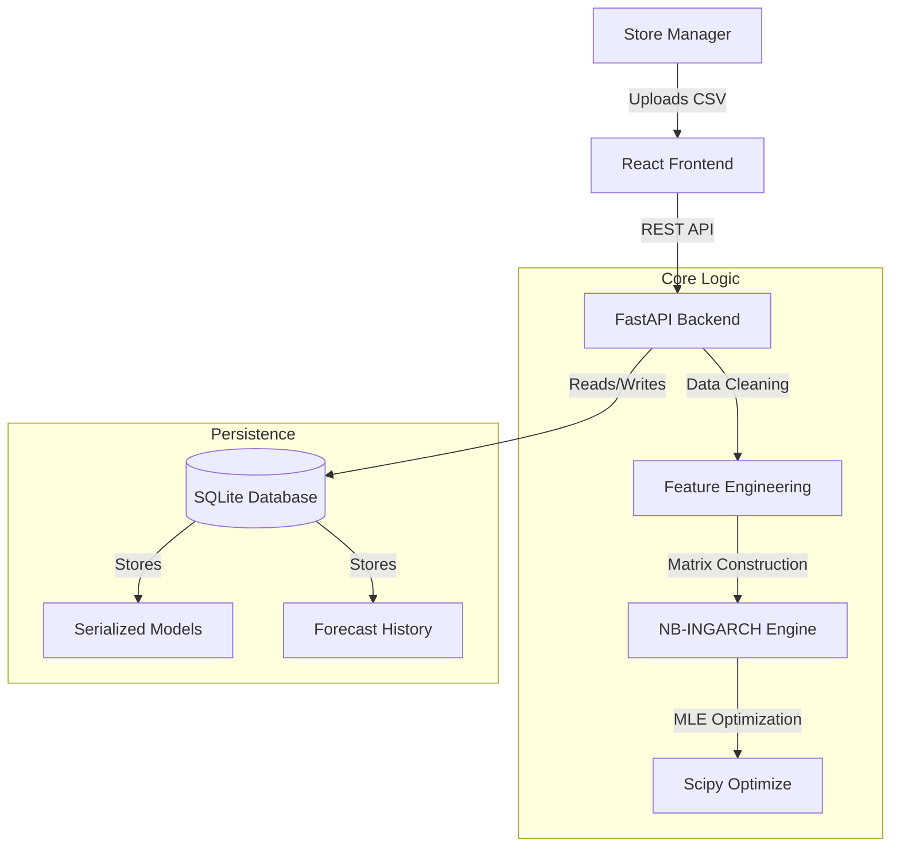

# StorePulse: Viva Defense Guide & Technical Specification

> **Document Purpose**: This guide provides the formal, academic, and technical depth required for a panel defense. Unlike the "Project Bible" (which is for general understanding), this document focuses on **rigor, methodology, and justification**.

---

## 1. Problem Statement & Motivation

**The Core Problem**: Retail demand forecasting is characterized by **count data** (non-negative integers) that exhibits **overdispersion** (variance > mean) and **volatility clustering** (periods of high variance).

**Why Traditional Methods Fail**:
*   **Linear Regression**: Assumes homoscedasticity (constant variance) and normal distribution. Retail data is heteroscedastic and skewed.
*   **ARIMA**: Designed for continuous data. Can predict negative values or fractions, which are physically impossible for customer counts.
*   **Poisson Regression**: Assumes Mean = Variance ($\lambda$). In retail, variance is typically much higher than the mean (Overdispersion), leading to underestimated risk.

**The Proposed Solution**: A **Negative Binomial Integer-GARCH (NB-INGARCH)** model.
*   **Negative Binomial**: Explicitly handles overdispersion via a dispersion parameter.
*   **IN-GARCH**: Models the time-varying conditional variance, capturing "bursty" traffic patterns.

---

## 2. Mathematical Formulation

The system implements a first-order NB-INGARCH(1,1) model.

### 2.1. Conditional Mean ($\lambda_t$)
The expected number of visits at time $t$ is modeled as a linear function of past observations (Autoregression) and past expectations (GARCH-like smoothing), plus exogenous covariates.

$$ \lambda_t = \beta_0 + \sum_{i=1}^p \beta_i Y_{t-i} + \sum_{j=1}^q \alpha_j \lambda_{t-j} + \gamma^T X_t $$

Where:
*   $\beta_0$: Baseline intercept.
*   $\beta_i$: Autoregressive coefficients (dependency on past counts).
*   $\alpha_j$: Feedback coefficients (dependency on past means).
*   $X_t$: Vector of exogenous variables (Weekend, Holiday, Promotion).

### 2.2. Conditional Distribution
The observed count $Y_t$ follows a Negative Binomial distribution conditioned on $\lambda_t$ and a dispersion parameter $\phi$:

$$ Y_t | \mathcal{F}_{t-1} \sim \text{NegBin}(\text{mean}=\lambda_t, \text{dispersion}=\phi) $$

The variance is given by:
$$ \text{Var}(Y_t) = \lambda_t + \frac{\lambda_t^2}{\phi} $$

*   As $\phi \to \infty$, the distribution converges to Poisson (Mean = Variance).
*   Small $\phi$ indicates high overdispersion (Variance >> Mean).

---

## 3. System Architecture

The application follows a **Clean Architecture** pattern to ensure maintainability and testability.

### 3.1. High-Level Diagram

### 3.2. Key Components
1.  **Frontend (Presentation Layer)**: React + Tauri. Handles user interaction and visualization.
2.  **API (Application Layer)**: FastAPI. Manages request lifecycle, validation, and error handling.
3.  **ML Engine (Domain Layer)**: Custom Python implementation of NB-INGARCH. Uses Maximum Likelihood Estimation (MLE) to fit parameters.
4.  **Database (Infrastructure Layer)**: SQLite. chosen for zero-configuration, offline persistence.

---

## 4. Critical Defense Q&A (The "Grill" Session)

### Q1: "Why didn't you use LSTM or Transformers?"
**Answer**:
1.  **Data Scarcity**: Deep learning models require thousands of data points to generalize. Most individual stores only have 1-2 years of history (<700 points).
2.  **Interpretability**: Neural networks are "black boxes". NB-INGARCH provides interpretable coefficients (e.g., "Weekends increase traffic by 20%").
3.  **Overhead**: LSTMs require heavy compute (GPU). This app needs to run on a standard manager's laptop.

### Q2: "How do you validate the model?"
**Answer**:
We use a **Walk-Forward Validation** (Rolling Window) approach:
1.  Train on days $1$ to $T$.
2.  Predict $T+1$ to $T+7$.
3.  Compare with actuals using **RMSE** (Root Mean Square Error) and **MAE** (Mean Absolute Error).
4.  **Coverage Test**: We verify if the 90% prediction interval actually captures ~90% of the true data points.

### Q3: "What is the 'Quality Gate' mentioned in your report?"
**Answer**:
Before a model is deployed, it must pass automated checks:
*   **Stationarity**: The time series must not have a unit root (checked via Augmented Dickey-Fuller test logic).
*   **Improvement**: The model must outperform a naive "Moving Average" baseline by at least 8%.
*   **Convergence**: The MLE optimization must converge successfully.

### Q4: "How does the application handle scalability?"
**Answer**:
*   **Vertical Scaling**: The current SQLite + In-Memory architecture handles up to ~5 years of daily data per store effortlessly.
*   **Horizontal Scaling**: For a chain of stores, the architecture allows deploying independent instances per store (Edge Computing), or the backend can be containerized (Docker) and deployed to a cloud server with a PostgreSQL database replacing SQLite.

---

## 5. Implementation Details for Code Walkthrough

If asked to show code, navigate to these files:

*   **The Math**: `ml/train_ingarch.py` -> Show the `negative_log_likelihood` function. This is the core mathematical optimization.
*   **The Features**: `api/core/feats.py` -> Show how `_add_lag_features` works. This demonstrates handling of time-series dependencies.
*   **The API**: `api/routes/forecast.py` -> Show the `generate_forecast` function. This shows how the model is integrated into the application flow.

---

## 6. Future Scope

1.  **Multi-Store Aggregation**: Cloud dashboard to view all stores.
2.  **Inventory Integration**: Direct API link to POS systems (e.g., Shopify, Square).
3.  **Advanced Exogenous Variables**: Real-time weather API integration (currently uses historical/manual entry).

---
*Prepared for Final Year Project Defense / Technical Panel Review*
